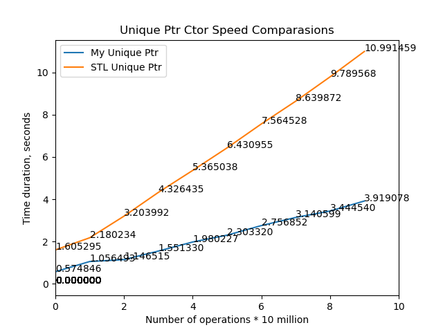
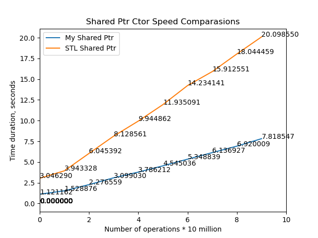

# Smart Pointers For Fun in CPP (C++)

This project is an implementation of C++ smart pointers similar to the standard `std::unique_ptr`, `std::shared_ptr` and `std::weak_ptr`.

## Opportunities

*   **`UniquePtr<T, Deleter>`**:
    * Exclusive ownership of the resource.
    * Automatic memory release when exiting the scope.
    * Support for custom deleters.
    * Specialization for arrays (`Unique Ptr<T[], Delete>`).
    * The `make_unique_ptr` function.
    * Move semantics.
*   **`SharedPtr<T, Deleter>`**:
    * Shared ownership of a resource with reference counting.
    * Automatic memory release when the last `Shared Ptr` is destroyed.
    * Support for custom deleters.
    * Specialization for arrays (`Shared Ptr<T[], Delete>`).
    * The `make_shared_ptr` function.
    * Atomic reference counting (not thread-safe).
*   **`WeakPtr<T>`**:
    * Non-owning reference to an object managed by a `Shared Ptr'.
    * Allows you to "observe" an object without increasing the reference count.
    * Methods for checking if a pointer has expired (`expired()') and for obtaining a `Shared Ptr' (`lock()`).

## Build & Install

Instructions for building and installing the project are in the 'INSTALL` file.

## Testing
The project includes a set of tests using Google Test. The tests verify the correctness of creating, assigning, moving, deleting, and other aspects of smart pointers.

```
cd build
ctest
```

## Speed Comparasions

UniquePtr


SharedPtr


## Technologies
C++ 17
CMake
Coverage
Memcheck

## License
[MIT License](LICENSE)
